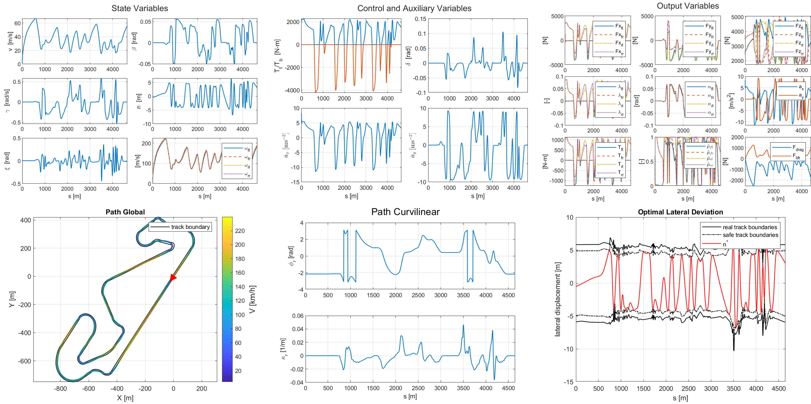

## Planificación y Seguimiento de Trayectorias de Tiempo Óptimo para Vehículos Autónomos
TOTPT resuelve la línea de carrera de tiempo óptimo utilizando programación no lineal (NLP) con el enfoque de colocación directa, y realiza el seguimiento de trayectorias con NMPC dentro del escenario de carrera implementado en Simulink.

## Instalación
### Requisitos previos
* Matlab y Simulink (probado en R2017a y R2022a en Win11)
* Instala [CasADi](https://web.casadi.org/get/)
* Instala [acados para Matlab](https://docs.acados.org/installation/index.html#windows-for-use-with-matlab)

[Descarga TOTPT](https://github.com/zlijunting/TOTPT/archive/refs/heads/main.zip) y descomprímelo en un directorio local

### Dependencias
* Ejecuta `totpt_env_variables.m` para añadir las subcarpetas a la ruta de búsqueda de Matlab
* Abre `acados_env_variables_windows.m` en la carpeta `nmpc` e introduce las rutas de instalación de acados y casadi en las dos líneas
```
acados_dir = 'A:\path\to\acados';
casadi_dir = 'B:\path\to\casadi-3.6.5';
```

## Flujo de trabajo
1. Navega a la carpeta `tro`, ejecuta el script interactivo `tro_main` para generar la línea de carrera de tiempo óptimo suavizada (1~3 min, dependiendo del tamaño del problema) 
2. Navega a la carpeta `nmpc`, ejecuta `nmpc_gen` para generar la función mex de NMPC y copiarla automáticamente a la carpeta `sim`
3. Navega a la carpeta `sim`, ejecuta el script interactivo `racing_sim` para simular el escenario de carrera


   


   


## Carpetas
* `racetrack-database`: líneas de carrera y anchos de pista de circuitos de carreras, derivado de (https://github.com/TUMFTM/racetrack-database)
* `functions`: funciones auxiliares para el procesamiento de la pista
* `params`: parámetros de suavizado de la pista y parámetros del vehículo
* `tro`: marco de trabajo para la optimización fuera de línea de trayectorias de tiempo óptimo
* `nmpc`: marco de trabajo para el seguimiento en línea de trayectorias con NMPC

## Citación
```
@article{li2024time,
  title={Time-Optimal Trajectory Planning and Tracking for Autonomous Vehicles},
  author={Li, Jun-Ting and Chen, Chih-Keng and Ren, Hongbin},
  journal={Sensors},
  volume={24},
  number={11},
  pages={3281},
  year={2024},
  publisher={MDPI}
}
```
